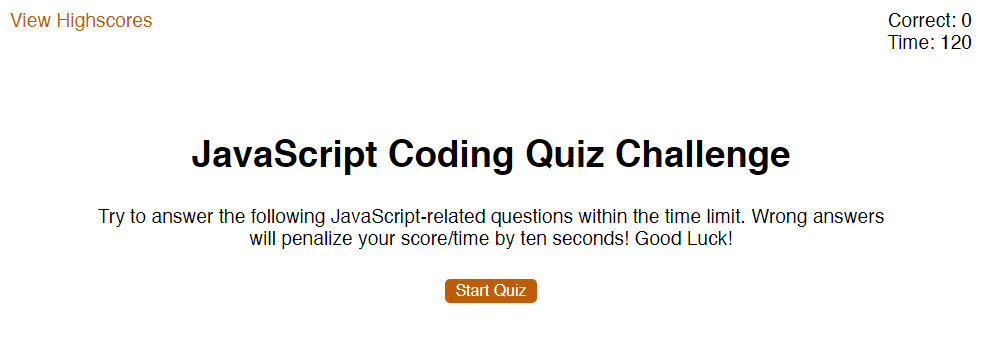
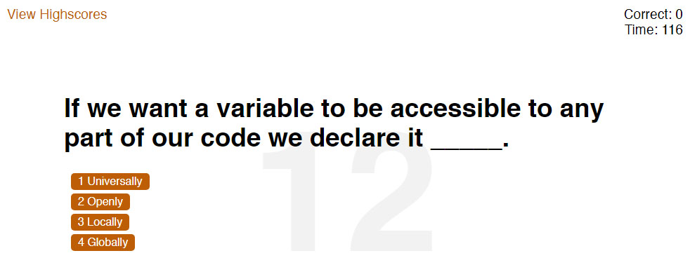

# JavaScript Coding Quiz Game
## Description
This website is designed to be an interactive quiz game with the focus of the questions being JavaScript fundamentals. I built this project to help reinforce the foundations of JavaScript and be a helpful tool for programming students to gauge their learning progress. By implementing a scoring process that totals up correct answers and rewards quick responses, I hope to create a more engaging environment for learning. The player is able to save their scores for reference on progress. 

Through the process of building this game I learned several useful programming techniques. I practiced designing an HTML document that would be the host for dynamically loaded data using JavaScript. I implemented the use of a normalize.css file to give me a clean styling foundation. I refined my css to flow efficiently from one group of content to the next and made use of specific tweaking styles classes. Setting up a “hidden” class that is dynamically applied with JS was useful to update the game state by hiding and showing desired HTML elements. I stored the data for my questions in an array of question objects and assigned the properties of each unique object to the question section of the HTML dynamically. The score at the end of the game is stringified using JSON to save it to local storage and then be pulled back to display a list of high scores on another page. I practiced complex ternary operators to apply a sorting method to the list of scores which orders them by correct answers, then second remaining. Throughout the process of building the website I took time to refactor and optimize my code and provide useful comments for other programmers to better understand my thinking.

## Live Site
https://williamcrownover.github.io/javascript-coding-quiz/

#### Start Screen

#### Example Question

